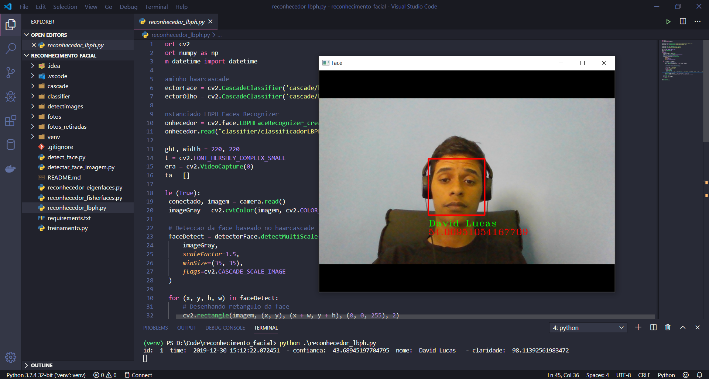

# Reconhecimento Facil OpenCV

<p align="center">
    
</p>
Projeto de reconhecimento facil com OpenCV - após treinamento das faces pelo algoritmo será capaz de fazer a detecção por frame

## Começando

Primeiro será necessário realizar a detecção da face e capturar as fotos para o treinamento executando o "dectect_face.py"
Depois será feito o treinamento das face capturadas com o "treinamento.py"
E no final você poderá escolher quais dos 3 algoritmos (Eigenface, Fisherface ou LBPH) usará para fazer o reconhecimento

### Pré-requisitos

Instale todas as dependências do requirements.txt com PIP


### Instalação

Crie um virtual env para empacotar suas libs Python

```
python -m venv venv
```

Ative sua virtual env

```
source venv/bin/active
```

Use o PIP, gerenciador de pacotes do Python para instalar todos os requisitos

```
pip install -r requirements.txt
```

## Uso do programa

1 - Primeiro faça as capturas salvando as imagens das faces detectadas:

```
python detect_face.py
```
digite um numero para ser o identificador da face e clique na tecla "q" para salvar a imagem da face detectada.


2 - Faça o apredizado das faces detectadas:

```
python treinamento.py
```
3 - Execute o reconhecedor facil

```
python reconhecedor_eigenfaces.py || python reconhecedor_fisherfaces.py || python reconhecedor_lbph.py
```

## Built With

* [OpenCV](https://pypi.org/project/opencv-contrib-python/) - OpenCV
* [Numpy](https://numpy.org/) - Numpy
* [Python](https://www.python.org/) - Python

## Authors

* **David Lucas** - *Initial work* - [david-luk4s](https://github.com/david-luk4s)
